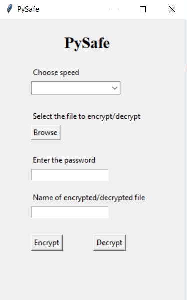
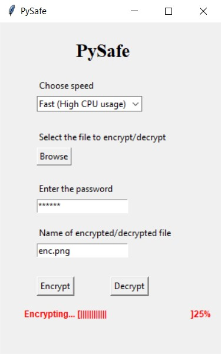
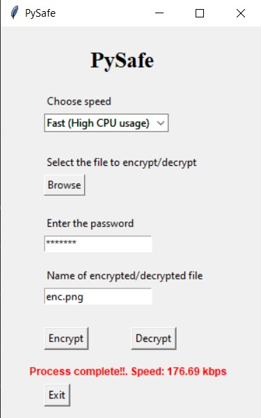

# PySafe - Keep your files safe

PySafe is a file encryption desktop application written in Python. It is a simple offline solution to keep all your important files and documents safe without uploading them to the cloud or using any internet resources.

### Features:
  <ul>
    <li>A simple and intuitive GUI</li>
    <li>All file formats supported</li>
    <li>High speed encryption using multiprocessing</li>
    <li>Password hashing with SHA-256</li>
    <li>Secure DES encryption</li>
    <li>Freedom to select speed</li>
  </ul>
  
  
### Usage
Run the python script "main.py" to launch the GUI.

  
  
  

Note: When inputting the output file name, it is upto the user to preserve the extension. If no extension is mentioned, it will be treated as a text file.
